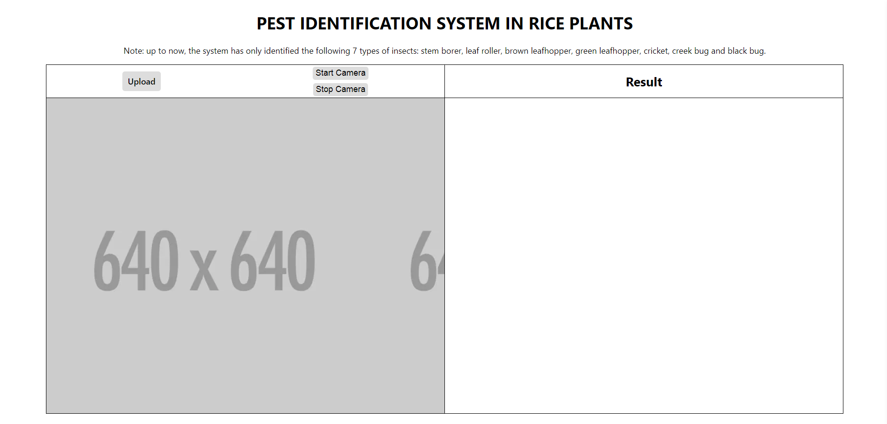
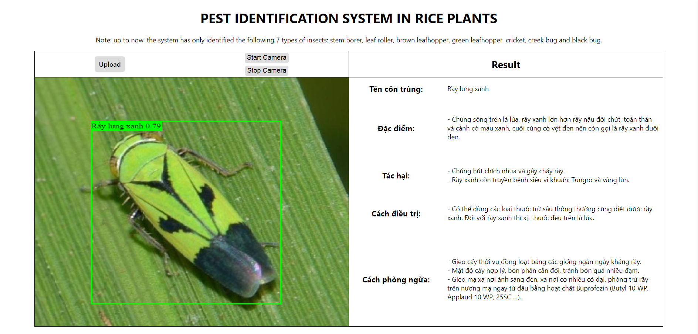
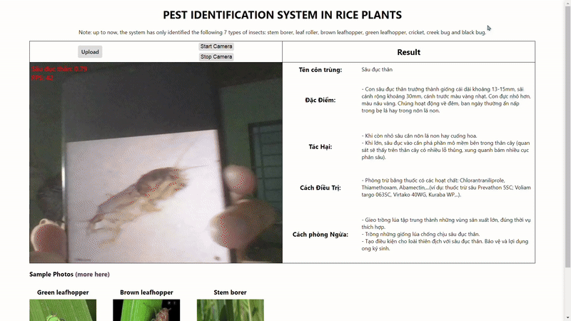

# Pest identification system in rice plants
- The system uses YOLO (Yolov8n) for training, the test results on the test set are **F1 ≈ 95%, mAP50 ≈ 95%**.
- The collected dataset includes **3,500 photos** including 7 types of harmful insects in rice plants, including: Stem borer, Leaf rollers, Brown leafhoppers, Green leafhopper, Crickets, Creek compensation and Black bugs.
- Split data for model training:
  - Training: 21000 images.
  - Validation: 700 images.
  - Testing: 700 images.
- [Report here](https://drive.google.com/file/d/1VqpZIE3QkztcQKSmE4ew5tF8251MY7F5/view?usp=sharing)
## Overviews
 

## Predict a photo
 

## Camera prediction


## Installation
1. git clone
```bash
git clone https://github.com/phanminhtai23/Insects-Yolov8-on-Camera-with-NodeJS-ONNX.git
cd ./Insects-Yolov8-on-Camera-with-NodeJS-ONNX
```
2. setup
```bash
npm install
```
3. run
```bash
npm run dev
``` 
